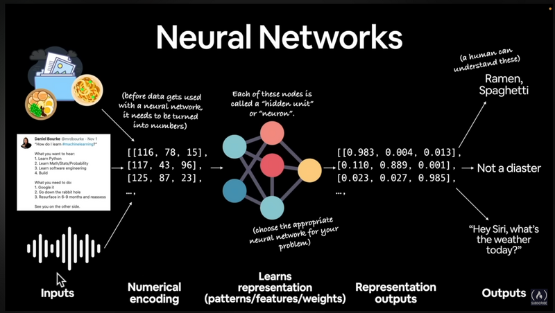
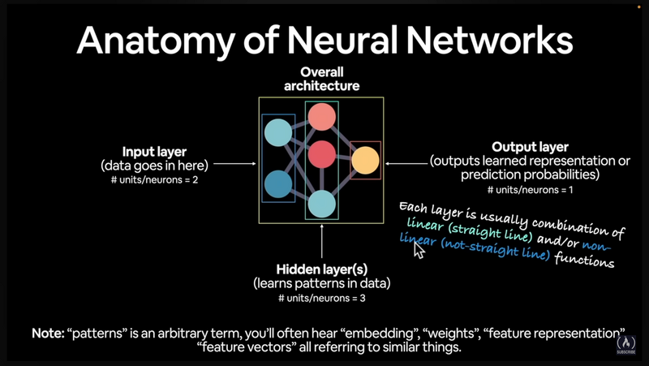
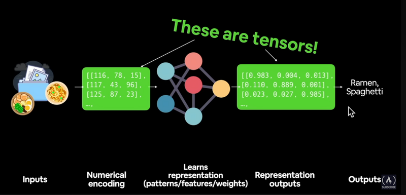
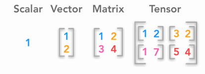
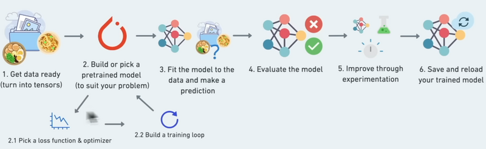
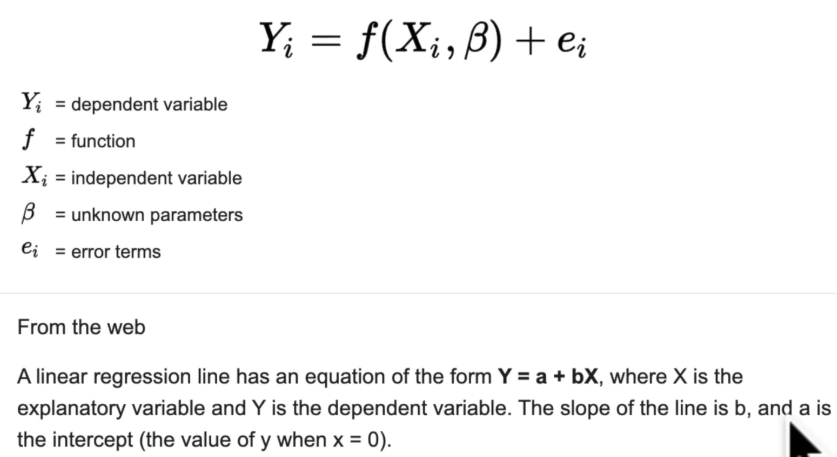

## Intro

[Accompanying course book to this course](https://www.learnpytorch.io/)

[Repo with code, exercises and slides](https://github.com/mrdbourke/pytorch-deep-learning) and [discussion](https://github.com/mrdbourke/pytorch-deep-learning/discussions)

[google colab](https://colab.research.google.com/)

### What will this course cover?

- Pytorch basics and fundamentals / tensors and tensor operations
- preprocessing data
- building and using pretrained deel learning models
- fitting a model to data (learning patterns)
- making predictions with a model (using patterns)
- evaluation of model predictions
- saving and loading models
- using a trained model on custom data

### General terms

- Machine learning is turning data into numbers and finding patterns in those numbers

**Artificial Intelligence** is a _superset_ of **machine learning** which _is a superset_ of **deep learning**

- Traditional programming: inputs -> rules -> output
- Machine learning (supervised learning): Inputs + known outputs -> rules (that can be applied to more inputs with unknown outputs)

Outputs: also known as features / labels

### Why use machine learning?

- Some problems are too complex / numerous or the rules are simply not known to build them algorithmically
- continually changing environments / rules
- large datasets (same as "too many rules")
- discovering insights in large datasets (same as "unknown rules")

### When not to use ML

- If a simple rule-based system can be built w/o ML, do that (google ML rule from [handbook](https://developers.google.com/machine-learning/guides/rules-of-ml))
- If explainability is required, e.g. financial transactions. Usually a trained ML model is an uninterpretable  blackbox.
- If errors are unacceptable (outputs are probabilistic, so they _can_ be wrong occasionally)
- When not much data with known outputs is available for the given problem

### Machine learning vs deep learning

#### Machine learning

_Typically..._

- uses structured data (e.g. a spreadsheet)
- typical algos ("shallow algorithms"): 
  - XGBoost (gradient boosted machine)
  - random forest
  - naive bayes
  - nearest neighbor
  - support vector machine
  - ...

#### Deep learning

_Typically..._

- Unstructured data (such as texts, images, audio), though images / audio are or can be turned into structured data
- uses neural networks such as
  - fully connected NNs
  - Convolutional NNs
  - Recurrent NNs
  - Transformer
  - ...

#### Overlap

Depending on how a problem is represented, many algorithms can be used for both structured and unstructured data, e.g. a text could be converted into a table with word counts and positions, and an image is basically a bitmap (x and y positions and color information in the "cells") anyway.

### What are neural networks?

- Unstructured data (e.g. Texts) (=**inputs**) is turned into numbers (matrices / tensors)
- neural network (input layer -> hidden layers (optional) -> output layer): learns representation (patterns / features / weights)
- creates representation outputs (features, weight matrix)
- outputs can be converted in human understandable terms, such as "image is of a bird"

### Anatomy of neural networks

- The "deep" in deep learning comes from the typically huge amount of hidden layers

### Types of learning

- Supervised learning
  - typically if there are lots of existing samples with known labels / outcomes
- un-supervised and self-supervised learning
  - typically just the data without labels is present. Learns patterns (e.g. clusters) only from the data itself. Labels are later assigned by humans to the patterns.
- Transfer learning
  - Takes patterns of an existing model and tries to apply them to a different problem
- Reinforcement learning
  - >Reinforcement learning is a machine learning training method based on rewarding desired behaviors and/or punishing undesired ones. In general, a reinforcement learning agent is able to perceive and interpret its environment, take actions and learn through trial and error.

The course will focus on supervised learning and transfer learning. [source](https://www.techtarget.com/searchenterpriseai/definition/reinforcement-learning)

### What is deep learning used for?

- recommendation
- translation
- language models (chatgpt)
- seq2seq = sequence to sequence = sequential data (audio) in, sequential data (text) out
  - speech recognition 
- classification / regression
  - computer vision (self driving cars etc)
  - natural language processing (NLP), e.g. for spam detection

### Pytorch

[pytorch home](https://pytorch.org/)

- most popular research deep learning framework
- fast (can run on GPUs using cuda and TPUs = tensor processing unit) 
- can access pre-built models from [torch hub](https://pytorch.org/hub/)
- full stack from preprocessing data to model deployment

[good general ML resource: paperswithcode](https://paperswithcode.com/sota)

### What is a tensor?

- almost any representation of data

[what is a tensor video](https://www.youtube.com/watch?v=f5liqUk0ZTw)

Pytorch: A `torch.Tensor` is a multi-dimensional matrix containing elements of a single data type.

taken from https://hadrienj.github.io/posts/Deep-Learning-Book-Series-2.1-Scalars-Vectors-Matrices-and-Tensors/ 

Note: ALL items are tensors, just with different numbers of dimensions (scalar: 0 dimensions, Tensor: 3+ dimensions)

Typically scalars and vectors are written lowercase (e.g. `myscalar`, `coords`) and matrices and tensors in UPPERCASE (e.g. `MATRIX`, `DATA`)

### Pytorch workflow

## Google colab

- Use GPUs: Runtime -> change runtime type
- convert cell to text cell: **ctrl-m m**
- run cell: ctrl-enter
- run from current cell to the end: ctrl-f10
- ctrl-d to select the next match of the currently marked text works too
 
## Most course notes from here on the individual notebooks

- [00_pytorch_fundamentals_video.ipynb](./00_pytorch_fundamentals_video.ipynb)
- [00_pytorch_fundamentals_video.ipynb](./00_pytorch_fundamentals_exercises_done.ipynb)

## Unsorted / images for the colabs

Nice chatgpt analogy for gradient descent and backpropagation:

>Backpropagation and the concept of gradients can be complex topics, especially if you're just getting started with neural networks and deep learning. It's great that you're asking questions and seeking to understand these concepts.
> 
>Here's a simpler way to think about it: imagine you're on a hill and your goal is to get to the bottom. You're blindfolded, so you can't see where to go, but you can feel the slope of the hill under your feet.
> 
>If you feel the ground sloping downwards to your right, you know that if you step to the right, you'll go downhill. If you feel the ground sloping downwards to your left, you know that if you step to the left, you'll go downhill. By repeatedly feeling the slope under your feet and taking a step downhill, you'll eventually reach the bottom of the hill.
> 
>In this analogy, the hill is the loss function, your position on the hill is the weights of the neural network, and the slope that you feel under your feet is the gradient. Just like how you can use the slope to figure out which way to step to go downhill, a neural network can use the gradient to figure out how to adjust its weights to reduce the loss.
> 
>The process of calculating the slope (gradient) is what we call backpropagation, and the process of taking a step downhill (updating the weights) is what we call an optimization step.

